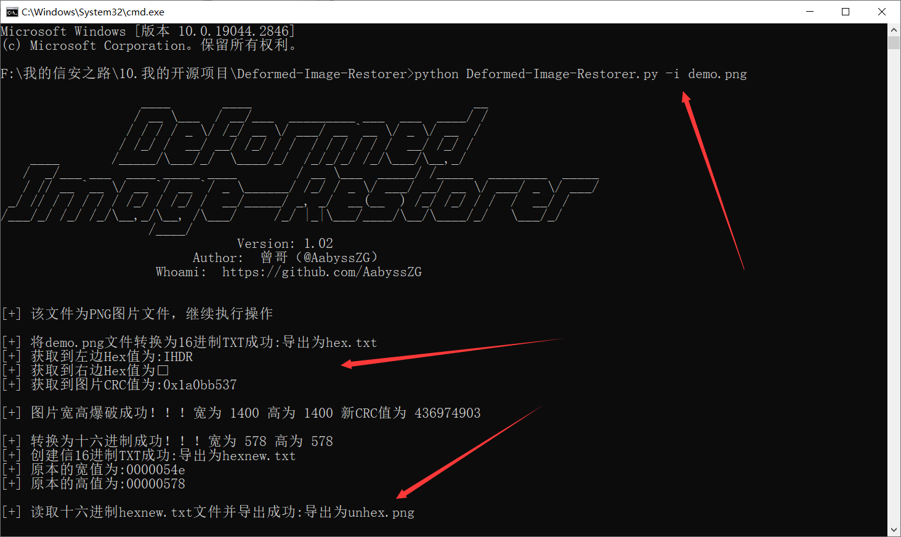

# Deformed-Image-Restorer

CTFer的福音，Misc手的利器，自动爆破图片宽高并一键修复工具

**最近打CTF打烦起来了，发现没人写一键解决畸形宽高png的工具，就花了一下午自己搓了一个~欢迎各位师傅点个Star！！！**

本项目的特点：

- 适配性高，能方便运行于Python3环境
- 操作简单，适合CTFer上手，能一键处理MISC中畸形宽高png文件并直接导出结果
- 傻瓜式操作，只需将需要处理的文件放入脚本目录即可

# 工具使用

```
                   ____       ____                              __
                  / __ \___  / __/___  _________ ___  ___  ____/ /
                 / / / / _ \/ /_/ __ \/ ___/ __ `__ \/ _ \/ __  /
                / /_/ /  __/ __/ /_/ / /  / / / / / /  __/ /_/ /
    ____       /_____/\___/_/  \____/_/  /_/_/_/ /_/\___/\__,_/
   /  _/___ ___  ____ _____ ____        / __ \___  _____/ /_____  ________  _____
   / // __ `__ \/ __ `/ __ `/ _ \______/ /_/ / _ \/ ___/ __/ __ \/ ___/ _ \/ ___/
 _/ // / / / / / /_/ / /_/ /  __/_____/ _, _/  __(__  ) /_/ /_/ / /  /  __/ /
/___/_/ /_/ /_/\__,_/\__, /\___/     /_/ |_|\___/____/\__/\____/_/   \___/_/
                    /____/
                                Version: 1.01
                          Author:  曾哥（@AabyssZG）
                     Whoami:  https://github.com/AabyssZG


用法:
        自动爆破图片宽高并修复图片:   python3 Deformed-Image-Restorer.py -i demo.png
        使用指定宽高修复导出图片:     python3 Deformed-Image-Restorer.py -r demo.png

参数:
        -i  --image    自动爆破图片宽高并导出修复后的图片
        -r  --reverse  使用指定宽高导出修复后的图片
```

# 工具演示

## 1、自动爆破图片宽高并修复图片

```
python Deformed-Image-Restorer.py -i demo.png
```



**发现导出成功了，在脚本根目录，直接修改文件后缀名即可拿到Flag**


## 2、使用指定宽高修复导出图片

```
python Deformed-Image-Restorer.py -r demo.png
```


**发现导出成功了，在脚本根目录，直接修改文件后缀名即可拿到Flag**


## 项目 Star 数量统计趋势图

[](https://starchart.cc/AabyssZG/Deformed-Image-Restorer)
